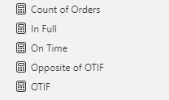
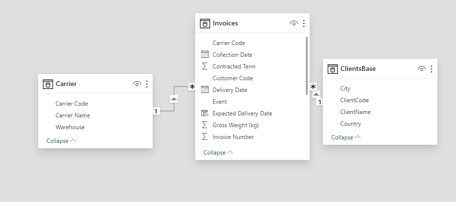
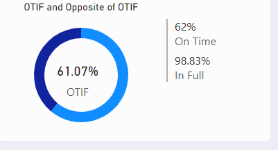
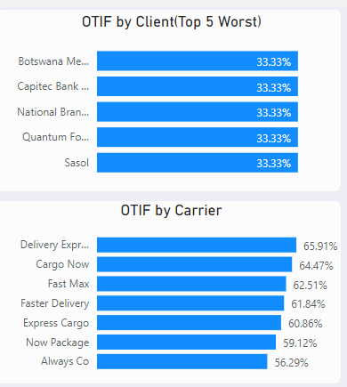
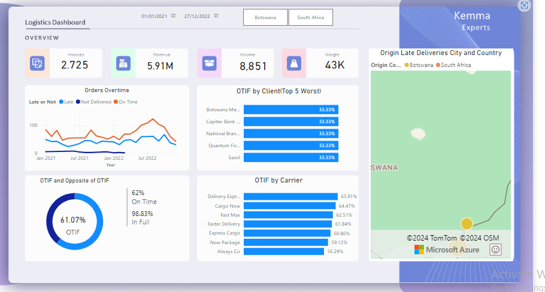

# Power-BI-Logistics-Dashboard

## INTRODUCTION
This project aims to develop a Data Analysis tool for analyzing the overall situation of clients and carriers OTIF using Power BI.

The Report consists of three pages:

A report page
Maps
Graphs

## PROBLEM STATEMENT
- Identify carriers' OTIF performance to present to managers

- Check the 5 worst OTIF accomplishment for clients so the team can create action plans for continuous improvement and immediately enhance their customer experience.

- Identify the origin of late deliveries.

## SKILLS DEMONSTRATED

## DATA SOURCING

## DATA TRANSFORMATION
Data cleaning and transformation was carried out using Power Query. After scrutinizing all the columns, they were found to be valid and devoid of empty cells and errors. However, It was highly important that I transformed the [Date] column which was in the 'date/time' format.

Therefore, I created 4 new columns all extracted from the source [Date] column.

The first cloumn contained the date in 'date' format (i.e dd/mm/yyy) and named it "New Date".
The second column was also extracted from the source [Date] column where I extracted the Month hierarchy and named it 'Month Name'.
Day Name was also extracted to constitute the third column and named Day Name column.
The last column was created for the time format of the source date column and named Time.

## MODELLING

## ANALYSIS AND VISUALIZATION
### Overall OTIF

### OTIF By Top Clients

## CONCLUSION AND RECOMMENDATION

